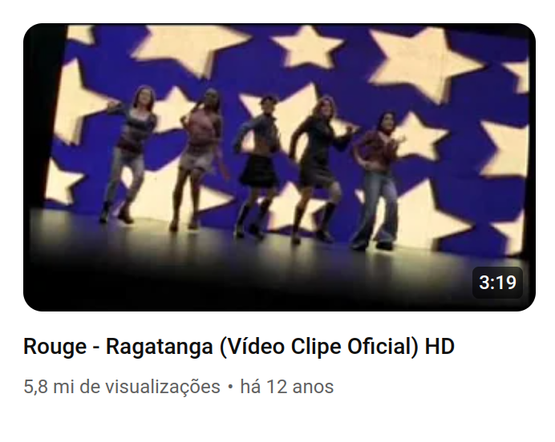
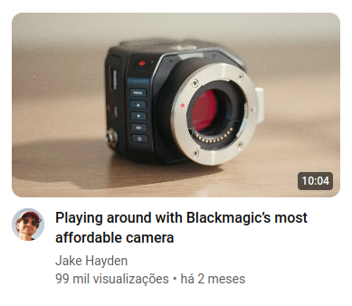
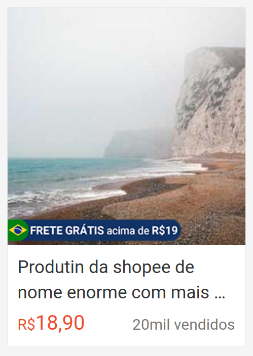
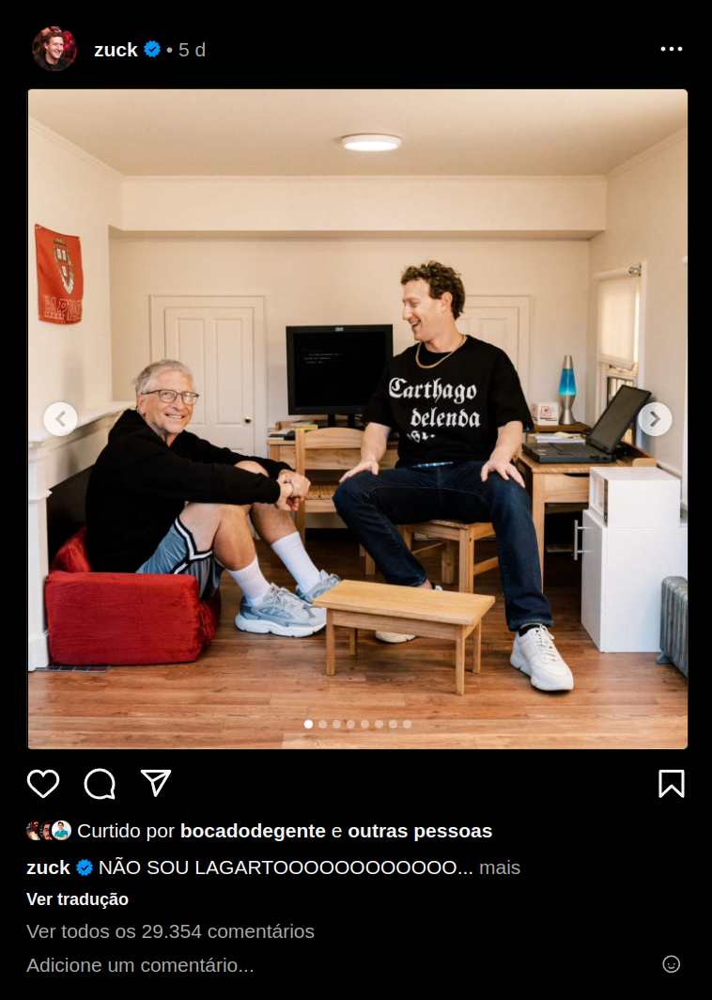

O exercício de HTML e CSS consiste em pegar alguns componentes que se repetem em algumas das páginas mais conhecidas e frequentadas diariamente pelo brasileiro e tentar replicá-los. Aqui vamos listar alguns compoenentes que queremos ver vocês replicando, mas fiquem a vontade para adicionar mais componentes e páginas que vocês achem interessantes.

Aqui vai um material introdutório que será necessário para a realização desse exercício:

- [HTML](https://www.w3schools.com/html/)
- [CSS](https://www.w3schools.com/css/)
- [Linkar CSS no HTML](https://www.w3schools.com/css/css_howto.asp)

# Vídeo em canal do YouTube

<table>
    <tr>
        <td>
            Dificuldade
        </td>
        <td>
            :star:
        </td>
    </tr>
    <tr>
        <td>
            Tempo estimado (fora o tempo de estudo)
        </td>
        <td>
            30 minutos
        </td>
    </tr>
    <tr>
        <td>
            Dica
        </td>
        <td>
            Utilize <code>position</code> para sobrepor elementos
        </td>
    </tr>
</table>

Ao acessar os vídeos de um canal no youtube, os vídeos são mostrados em uma lista. Cada item da lista possui somente quatro elementos:

- Imagem do vídeo
- Duranção do vídeo a cima da imagem
- Título do vídeo
- Subtítulo com número de visualizações e data de publicação

### Links reais para vocês usarem como referência:

- [Canal do YouTube da banda Rouge](https://www.youtube.com/@ChannelRouge/videos)
- [Canal do YouTube do próprio YouTube](https://www.youtube.com/user/YouTube/videos)

### Dificuldades e materiais de estudo

Para replicar esse componente, além do básico de CSS, vão precisar saber como posicionar elementos acima de outros. Aqui vão alguns links que podem ajudar:

- [Como utilizar `position`, W3Schools](https://www.w3schools.com/css/css_positioning.asp)
- [Como utilizar `position`, MDN](https://developer.mozilla.org/en-US/docs/Web/CSS/position)

# Vídeo em feed do YouTube

<table>
    <tr>
        <td>
            Dificuldade
        </td>
        <td>
            :star: :star:
        </td>
    </tr>
    <tr>
        <td>
            Tempo estimado (fora o tempo de estudo)
        </td>
        <td>
            30 minutos se tiver feito o exercício anterior
        </td>
    </tr>
    <tr>
        <td>
            Dica
        </td>
        <td>
            Utilize <code>position</code> para sobrepor elementos e <code>display: flex</code> para alinhar elementos
        </td>
    </tr>
</table>

Diferente do ultimo exemplo, no feed do YouTube, os vídeos são mostrados com mais informações. Cada item da lista possui os seguintes elementos:

- Imagem do vídeo
- Duranção do vídeo a cima da imagem
- Foto do autor do vídeo
- Título do vídeo
- Nome do autor do vídeo
- Subtítulo com número de visualizações e data de publicação

### Links reais para vocês usarem como referência:

- [Página inicial do YouTube](https://www.youtube.com)

### Dificuldades e materiais de estudo

Além do que foi citado no exemplo anterior, aqui vocês vão precisar de um pouco mais de conhecimento em CSS para posicionar os elementos de forma correta. Aqui vão alguns links que podem ajudar:

- [Como utilizar `display: flex`, W3Schools](https://www.w3schools.com/css/css3_flexbox.asp)
- [Como utilizar `display: flex`, MDN](https://developer.mozilla.org/en-US/docs/Web/CSS/CSS_Flexible_Box_Layout/Basic_Concepts_of_Flexbox)
- [Flexbox Playground](https://codepen.io/enxaneta/full/adLPwv/)
- [Flexbox Froggy](https://flexboxfroggy.com/)
- [Flexbox Defense](http://www.flexboxdefense.com/)
- [Flexbox Zombies](https://mastery.games/flexboxzombies/)

# Produto na Shopee

<table>
    <tr>
        <td>
            Dificuldade
        </td>
        <td>
            :star:
        </td>
    </tr>
    <tr>
        <td>
            Tempo estimado (fora o tempo de estudo)
        </td>
        <td>
            30 minutos
        </td>
    </tr>
    <tr>
        <td>
            Dica
        </td>
        <td>
            Além do <code>display: flex</code>, você pode alinhar elementos com <code>display: grid</code>
        </td>
    </tr>
</table>

Na página de um produto na Shopee, os produtos são mostrados com os seguintes elementos:

- Imagem do produto
- Bandeira de frete grátis
- Nome do produto
- Preço do produto
- Quantidade de vendas

Alguns produtos que tem descontos ou estão participando de campanhas podem ter outros elementos, como:

- Preço antigo
- Porcentagem de desconto
- Bandeira de campanha

Fique a vontade para adicionar esses elementos se quiser.

### Links reais para vocês usarem como referência:

- [Página inicial da Shopee](https://shopee.com.br/)

### Dificuldades e materiais de estudo

Assim como no YouTube, aqui vocês vão precisar de conhecimento na utilização de `position` e `display: flex`. Os mesmos links que foram citados anteriormente podem ser úteis aqui. Além disso, aqui vão alguns links que podem ajudar:

- [Como utilizar `display: grid`, W3Schools](https://www.w3schools.com/css/css_grid.asp)
- [Como utilizar `display: grid`, MDN](https://developer.mozilla.org/en-US/docs/Web/CSS/CSS_Grid_Layout)
- [Grid Garden](https://cssgridgarden.com/)
- [Grid Critters](https://mastery.games/gridcritters/)

# Post no X

<table>
    <tr>
        <td>
            Dificuldade
        </td>
        <td>
            :star: :star: :star:
        </td>
    </tr>
    <tr>
        <td>
            Tempo estimado (fora o tempo de estudo)
        </td>
        <td>
            1 hora e 30 minutos
        </td>
    </tr>
    <tr>
        <td>
            Dica
        </td>
        <td>
            Utilize <code>display: flex</code> para alinhar elementos
        </td>
    </tr>
</table>

Na página de um post no X, os posts são mostrados com os seguintes elementos:

- Imagem do autor
- Nome do autor
- Selo de verificado
- Usuário do autor
- Logo do X
- Texto do post
- Imagem
- Data de publicação
- Botão para curtir
- Número de curtidas
- Botão para comentar
- Botão para copiar link
- Botão para ver na rede social

### Links reais para vocês usarem como referência:

- [Página inicial do X](https://x.com/)
- [Página do Elon Musk no X](https://x.com/elonmusk)

### Dificuldades e materiais de estudo

Aqui, temos mais elementos que os exemplos anteriores, então o tempo será maior para estilizar todos eles, mas não temos mais a necessidade do position. Em contrapartida, temos diversos ícones e botões que podem ser um desafio para vocês. Aqui vão alguns links que podem ajudar:

- [Biblioteca de icones Boostrap](https://icons.getbootstrap.com/), descer até o fundo da página para instruções de uso
- [Biblioteca de icones Font Awesome](https://fontawesome.com/)
- [Como utilizar Font Awesome](https://fontawesome.com/how-to-use/on-the-web/referencing-icons/basic-use)
- [Como utilizar Font Awesome, W3Schools](https://www.w3schools.com/icons/fontawesome_icons_intro.asp), (pode estar desatualizado)

# Post carroussel no Instagram

<table>
    <tr>
        <td>
            Dificuldade
        </td>
        <td>
            :star: :star: :star: :star:
        </td>
    </tr>
    <tr>
        <td>
            Tempo estimado (fora o tempo de estudo)
        </td>
        <td>
            3 horas
        </td>
    </tr>
    <tr>
        <td>
            Dica
        </td>
        <td>
            Utilize <code>display: flex</code> para alinhar elementos, você pode usar <code>align-self</code> para alinhar elementos individualmente
        </td>
    </tr>
</table>

Na página de um post no Instagram, os posts são mostrados com os seguintes elementos:

- Imagem do autor
- Nome do autor
- Selo de verificado
- Data de publicação
- Imagem
- Botões para avançar e retroceder
- Indicador de qual imagem está sendo mostrada
- Botões de ações
- Pessoas que curtiram
- Texto do post
- Número de comentários

### Links reais para vocês usarem como referência:

- [Página inicial do Instagram](https://www.instagram.com/)
- [Página do perfil do Instagram do Mark Zuckerberg](https://www.instagram.com/zuck)

### Dificuldades e materiais de estudo

No Instagram, temos um carroussel de imagens, então aqui vamos treinar tudo que fizemos nos exercícios anteriores e mais um pouco. Vocês terão que utilizar bibliotecas de ícones em conjunto com `position: absolute` para posicionar os botões de avançar e retroceder. Além de termos diversos usos do `display: flex` com elementos alinhados à direita. Os estudos podem ser feitos a partir dos links dos exercícios anteriores.